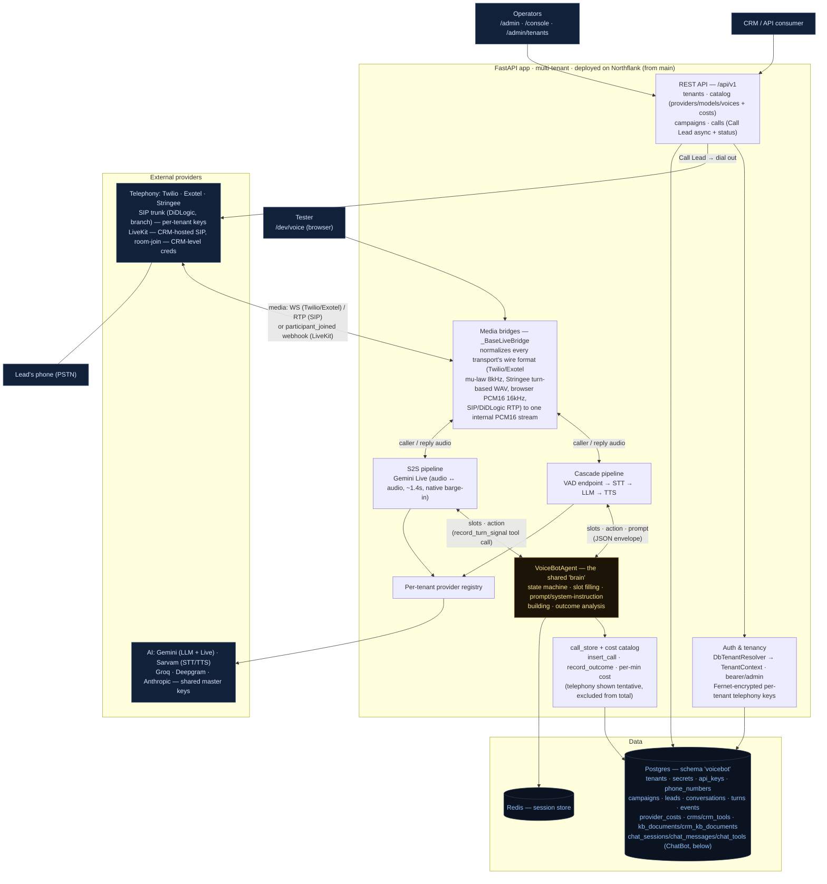
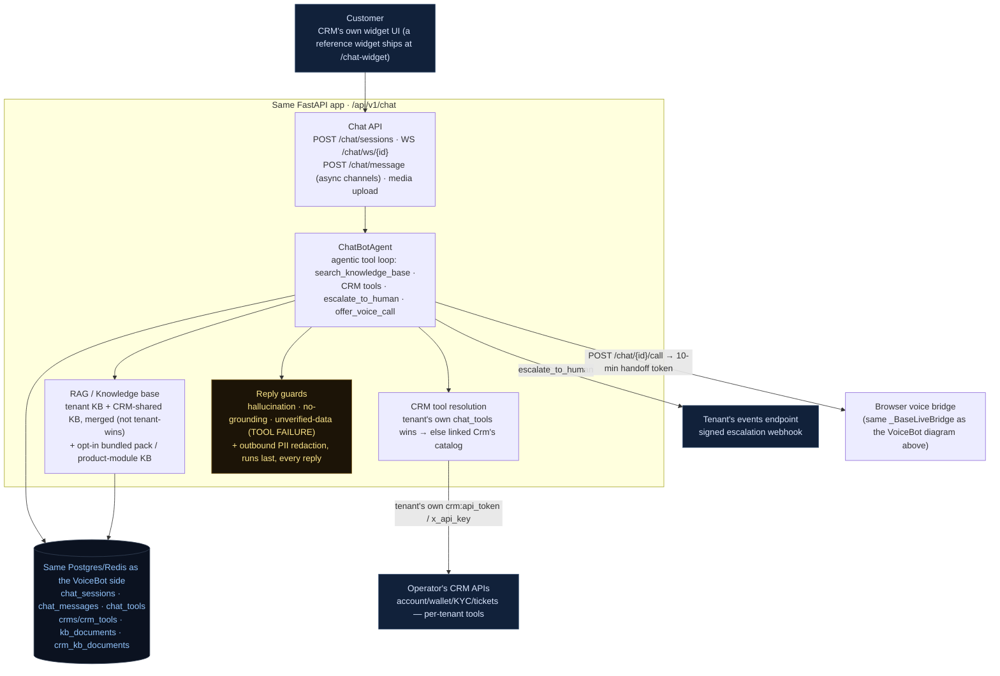
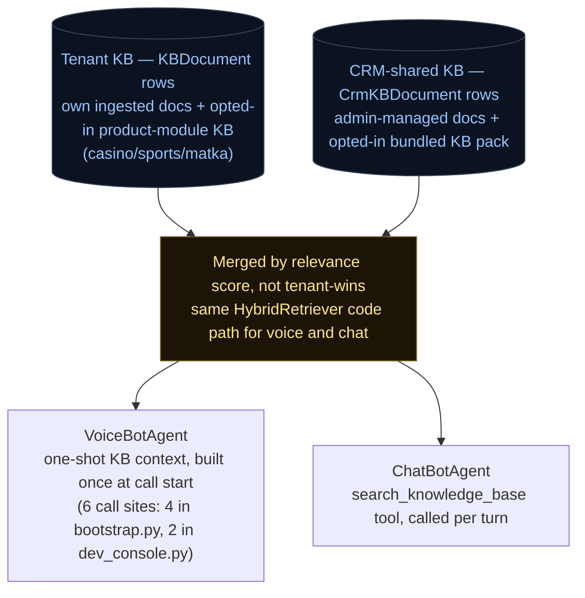

# Architecture

A single view of the system: a **multi-tenant, API-driven agent platform** with two
products sharing one backend. A CRM (or an operator via the browser consoles)
registers a tenant, then either places outbound calls (**VoiceBot**) or embeds the
chat widget for inbound support (**ChatBot**). Both run an AI agent — over telephony,
the browser, or a chat socket — against the same per-tenant provider registry,
knowledge base, and CRM-tool catalog, and are recorded + billed to the same database.

## VoiceBot: how a call flows



1. **Register** — `POST /api/v1/tenants` (admin) stores the tenant + provider/model
   choices; telephony keys are Fernet-encrypted into `tenant_secrets`. Returns an API token.
2. **Create campaign** — `POST /api/v1/campaigns` (+ CSV leads).
3. **Call Lead** — `POST /api/v1/campaigns/{id}/calls` (async, returns `call_id`): checks the
   campaign is active + the tenant's concurrency cap, places the outbound call on the tenant's
   telephony provider, and inserts an `in_progress` `conversations` row snapshotting the config.
4. **Run** — the carrier connects back to a **media bridge** (WS for Twilio/Exotel, in-process
   RTP for SIP, a room-join for LiveKit). The bridge runs the **VoiceBotAgent** in the tenant's
   mode (cascade or S2S), using the per-tenant **provider registry**. Slots/action/state come
   from the LLM JSON envelope (cascade) or the `record_turn_signal` tool call (S2S). LiveKit
   differs from the other providers in shape: the CRM fronts its own PSTN/SIP via LiveKit SIP
   and drops the caller into a room; this app has no outbound dial or inbound HTTP leg of its
   own for that path — the only trigger is a `participant_joined` webhook, and it joins as a
   WebRTC participant using CRM-level credentials (`Crm.livekit_url`), not per-tenant secrets.
5. **Teardown** — outcome analysis runs, and `record_outcome` writes status + outcome + **cost**
   (Σ provider cost/min × duration; telephony excluded as tentative) to the `conversations` row.
6. **Poll** — `GET /api/v1/calls/{id}` returns status/outcome/cost; the **backoffice**
   (`/admin/tenants`) aggregates per-tenant analytics + billing.

## ChatBot: how a chat flows



1. **Session** — `POST /chat/sessions` (tenant bearer) creates a `chat_sessions` row and
   returns `{session_id, greeting, ws_url}`; the `session_id` is itself the capability for the
   socket — `WS /chat/ws/{session_id}` needs no further auth.
2. **Turn** — the customer's message (text, image, or video) reaches `ChatBotAgent`, which runs
   an agentic loop: generate (text mode, tools available) → execute any tool calls
   (`search_knowledge_base`, a registered CRM tool, `escalate_to_human`, `offer_voice_call`) →
   feed results back → repeat → final reply. Every turn's knowledge search mixes the tenant's
   own KB with its linked CRM's shared KB (never tenant-wins-outright, unlike tools below);
   every CRM tool call resolves to the tenant's own registered tool first, falling back to the
   linked `Crm`'s shared catalog only if the tenant has none of its own.
3. **Grounding** — the reply passes through the hallucination/no-grounding guard when a KB
   search happened, and the unverified-data guard whenever a CRM tool was involved (called,
   or attempted and failed) — a number the reply states must trace back to something the model
   actually saw this turn, or the reply is replaced with a safe fallback, independent of what
   the model itself claims to have checked. A PII guard (`apply_pii_guard`) then runs last, on
   every reply and every suggested followup regardless of whether a KB search or tool call
   happened this turn: it redacts any Indian mobile number, email address, or anchor-gated bank
   account number the reply states, dropping a suggested followup outright rather than
   redacting it in place, and downgrades confidence to `"low"` whenever it fires.
4. **Escalate or hand off** — the agent can offer a human (`escalate_to_human`, a signed
   webhook to the tenant's events endpoint) or a live voice call (`offer_voice_call` /
   `POST /chat/{id}/call`, which stashes the chat's context under a short-lived Redis token and
   hands off into the *same* browser voice bridge the VoiceBot diagram uses — the voicebot
   greets with the chat's own context already loaded).
5. **Persist** — every turn is written to `chat_sessions`/`chat_messages` in the same Postgres
   database as the voice side; the tenant's own or backoffice's console reads it back for
   history, handoff, and analytics.

## One chat initiation, call by call

The section above is the component view. This is the same flow as a call path — the
functions one chat actually passes through, from `POST /chat/sessions` to the first
reply frame. Function names are the stable handle; the line numbers are a pointer that
drifts with the file.

### Session create, then socket connect

```mermaid
sequenceDiagram
  autonumber
  participant W as CRM widget
  participant API as src/api/chat.py
  participant AUTH as src/auth/middleware.py
  participant PG as Postgres
  participant BOOT as src/bootstrap.py

  rect rgb(17,33,58)
  Note over W,PG: POST /api/v1/chat/sessions — create_session, chat.py:1386
  W->>API: {user_id, customer_name, language, metadata}<br/>Authorization: Bearer &lt;tenant token&gt;
  API->>AUTH: Depends(current_tenant) — middleware.py:247
  AUTH-->>API: TenantContext (401 no credential · 403 suspended)
  API->>PG: INSERT chat_sessions<br/>status=active · language = normalize_lang(req) ?? tenant default ?? "hi"
  API-)API: _spawn_webhook_task(send_bo_webhook "session_started")<br/>fire-and-forget: a slow CRM endpoint must not stall creation
  API-->>W: 201 {session_id, greeting (_greeting), ws_url (_ws_url)}
  end

  rect rgb(11,40,30)
  Note over W,BOOT: WS /api/v1/chat/ws/{session_id} — chat_websocket, chat.py:1993
  W->>API: WS connect — session_id IS the capability, no credential on the socket
  API->>API: accept(); close 1011 if the chatbot factory is unset
  API->>PG: db.get(ChatSession, session_id) → row; close 4004 if absent
  API->>API: set_chat_context(session_id, ticket_id)<br/>ContextVars, so every record on this connection carries both ids
  API->>AUTH: tenant_from_id(row.tenant_id) — middleware.py:409; close 1011 if absent
  API->>PG: reconnect sweep — pending DepositVerificationRequest past timeout_at<br/>→ _check_and_timeout_verification, then re-fetch row (it may now be escalated)
  API->>BOOT: factory(tenant, "{tenant_id}:{session_id}", customer_id, ticket_id)<br/>make_chatbot_factory, bootstrap.py:468
  BOOT->>BOOT: resolve_crm_tools (per-tenant cached) — tenant's own chat_tools<br/>win outright, else the linked Crm's catalog
  BOOT->>BOOT: + submit_deposit_verification, only with enabled + webhook_url<br/>+ a resolvable HMAC secret
  BOOT-->>API: ChatBotAgent — platform LLM, tenant + CRM retrievers,<br/>Redis SessionStore, enable_tools=True
  API->>API: agent._previous_conversation = _stored_previous_conversation(row)
  API->>PG: _hydrate_agent_history — replay chat_messages into session.turns,<br/>joined through ChatSession so the query is tenant-scoped
  API->>API: fresh _async_push_queues[session_id]<br/>(a new queue every connection, so the finally below can pop by identity)
  alt row.mode in (awaiting_human, human)
    API->>API: _run_human_mode — reconnect straight into a live handoff
  else bot mode
    API->>API: enter the receive loop<br/>session_first_frame_pending = (row.message_count == 0)
  end
  end
```

### The first turn

```mermaid
sequenceDiagram
  autonumber
  participant W as Widget
  participant API as chat.py receive loop
  participant AG as ChatBotAgent
  participant LLM as Platform LLM — Gemini
  participant KB as RAG
  participant CRM as Operator CRM
  participant PG as Postgres · Redis

  W->>API: {type:"message", text:"..."}
  API->>API: asyncio.wait({receive_text, async_q.get},<br/>timeout=chat_idle_timeout_seconds)
  API->>API: _capture_previous_conversation — first frame of the session only
  API->>API: _try_begin_turn(session_id, _turn_fingerprint) duplicate guard<br/>+ new_trace_id() / trace_id_scope
  API-->>W: {type:"typing"}
  API->>AG: _run_turn_with_keepalive(agent.handle_message(text))<br/>emits _interim_wait_text bubbles while the turn runs long
  AG->>AG: handle_message → _handle_with_tools (chatbot.py:1035 → 1228)
  AG->>AG: _compose — system prompt (prompt_pack) + per-turn language directive<br/>(_detect_script / _latin_language_hint) + hydrated history
  loop up to _max_tool_rounds
    AG->>LLM: generate(messages, tools = BUILTIN + CRM, response_format="text")
    alt no tool calls
      LLM-->>AG: final text, loop ends
    else tool calls
      AG->>KB: search_knowledge_base → _exec_kb_tool → search_combined<br/>tenant + CRM retrievers merged by score, own _KB_SEARCH_TIMEOUT_S
      AG->>CRM: registered CRM tool → execute_crm_tool<br/>fair share of the per-turn _TOOL_BUDGET_S, capped at _TOOL_CALL_CEILING_S
      AG->>AG: escalate_to_human / offer_voice_call — local builders, zero I/O, unbudgeted
      AG->>AG: append role="tool" results, update the failure directive
    end
  end
  AG->>AG: parse the JSON envelope; a parse failure falls back to extracted text,<br/>never raw LLM JSON
  AG->>AG: guards — hallucination (retrieval happened) or no-grounding (it didn't),<br/>then unverified-data, then apply_pii_guard last
  AG->>PG: _persist to the Redis SessionStore<br/>+ _emit_turn_metric → chat_turn_metrics / chat_tool_metrics
  AG-->>API: ChatTurnResult(response, retrieved, escalation, call_offer)
  API->>PG: _persist_turn — customer + agent rows in chat_messages, message_count += 2
  opt result.call_offer
    API->>PG: Redis SET chat_handoff:{token} ex=600 → call_url = _voice_call_url
  end
  API-->>W: _send_reply — {type:"message", text, sources, suggestions, action}<br/>plus an escalation / call_offer frame when the tools fired one
  alt action == "resolved"
    API->>PG: summarize_session → _end_session → _send_close_webhook
    API-->>W: {type:"ended", summary, reason:"resolved"}
  else result.escalation
    API->>API: _handle_escalation → _run_human_mode
  end
```

### What the two diagrams leave out

- **Media frames** branch earlier in the loop than the text path above. An `audio` frame
  transcribes first, runs the same `handle_message`, and gets a synthesized voice-note
  reply back (`_synthesize_reply_audio`) when TTS and the media store are both wired.
  `image`/`video` persist the customer's row **before** running the turn, because
  `submit_deposit_verification` looks the screenshot up by querying `chat_messages` on a
  separate DB session and would miss an uncommitted row.
- **Three ways something other than a customer message reaches a live socket**: the
  `_async_push_queues` entry (deposit-verification webhook or its timeout sweep), the
  idle-timeout branch (farewell → `_end_session` → `ended` frame), and the human-mode
  queues once a session escalates.
- **Turn-level error containment** — a turn that raises is caught per-iteration:
  `_classify_turn_error` picks the reason, `_record_ws_turn_failure_metric` writes it
  before the customer-visible frame goes out, and the socket stays open for the next
  message.

## Shared knowledge base (VoiceBot + ChatBot)



A tenant's own knowledge base and its linked CRM's shared knowledge base are never
searched in isolation — every retrieval, whether it's the VoiceBot's one-shot
per-call context or the ChatBot's per-turn `search_knowledge_base` tool call, runs
against **both** and merges the results by relevance score, through the same
`HybridRetriever` code path either way. VoiceBot and ChatBot are two different
front ends onto one shared knowledge base per tenant/CRM pair, not two separate KB
systems that happen to look similar. A tenant with no linked CRM (`crm_id is None`)
simply gets tenant-docs-only results, never an error — the same graceful
degradation as CRM-tool resolution above.

Both feeder tiers are opt-in, at different scopes: product-module KB
(casino/sports/matka) is opted into per **tenant**, feeding the Tenant KB box;
bundled KB packs are opted into per **CRM** (`Crm.bundled_kb_pack`), feeding the
CRM-shared KB box. See `docs/chatbot.md` for how each is ingested.

## Key properties
- **Multi-tenant, DB-backed.** All state lives in Postgres under the `voicebot` schema (shared
  DB); tenants resolve from the DB via bearer token / admin. No YAML at runtime.
- **Two pipeline modes, one shared brain (VoiceBot).** Cascade (STT→LLM→TTS, the
  controllable default, ~3.2s first word) and S2S (Gemini Live, ~1.4s, native
  barge-in) are two different audio-processing paths in front of the *same*
  `VoiceBotAgent` — the state machine, slot filling, and prompt/system-instruction
  building don't change based on which pipeline is active, only how state gets in
  (a JSON envelope vs. a `record_turn_signal` tool call) and how audio gets out.
  Selectable per tenant (`pipeline.mode`); LiveKit calls also run through the S2S path.
- **Key isolation.** Only telephony keys are per-tenant (Fernet-encrypted); STT/LLM/TTS/S2S use
  shared platform master keys. LiveKit credentials are CRM-level (`Crm.livekit_url`), not
  per-tenant — a third tier alongside "per-tenant" and "shared platform."
- **Cost model.** `provider_costs` keyed `(kind, provider, model)`, per-minute; per-call cost is
  the platform components only — telephony is the tenant's own trunk, shown as a *tentative* figure.
- **Vertical content is opt-in per CRM, not baked into the platform (ChatBot).** A `Crm.prompt_pack`
  column selects which system-prompt vocabulary a linked tenant's ChatBot uses (`"generic"` by
  default, no industry-specific vocabulary; `"betting"` for the live betting operator); a
  `Crm.bundled_kb_pack` column separately selects which knowledge-base bundle (if any) is
  auto-seeded into that CRM's shared KB at boot. A CRM with neither set gets a fully
  industry-neutral chatbot with no bundled KB — the platform core makes no assumption about
  what kind of business a tenant runs.
- **CRM tools are substitutive, KB is additive.** A tenant's own registered CRM tool always
  wins outright over its linked `Crm`'s shared catalog (one implementation runs, never both);
  knowledge-base search always merges the tenant's own docs *with* the linked CRM's shared docs
  (both are useful at once, so both are searched).
- **Browser consoles** are thin UIs over the same `/api/v1` (so using them exercises the API):
  `/admin` (register + costs), `/console` (campaigns/calls), `/admin/tenants` (analytics + billing),
  `/dev/voice` (live voice test — recorded + billed like a real call), `/chat-widget` (reference
  chat UI — recorded + billed like a real chat session).

## Tools & providers by module

Every provider below is config-selected per tenant (or per CRM, where noted) through
`src/providers/get_*` — swapping one is a config change, not a code change, except
where noted.

| Module | Options | Notes |
|---|---|---|
| STT (batch) | Sarvam · Groq (Whisper) · Gemini | |
| STT (streaming) | Deepgram | the only streaming STT provider; batch providers above are the fallback |
| LLM | Gemini (also the S2S/Live provider) · Groq · Anthropic Claude · self-hosted vLLM (OpenAI-compatible, e.g. an IndicF5 RunPod pod) | Gemini is the active default for both VoiceBot and ChatBot |
| TTS | Sarvam · Gemini · Google · Azure · ElevenLabs · self-hosted IndicF5 | Sarvam (`bulbul:v3`, speaker `priya`) is the active default — Sarvam deprecated `bulbul:v2` and rejects `bulbul:v2`/its old speakers (e.g. `anushka`) outright on v3 |
| Telephony (dial-out) | Twilio · Exotel · Stringee | behind the common `ITelephonyProvider` interface |
| Telephony (room-join) | LiveKit — CRM-hosted SIP, CRM-level credentials | separate integration, not behind `ITelephonyProvider` (no dial-out leg on this side) |
| Telephony (in progress) | SIP trunk / DiDLogic (pyVoIP, in-app RTP) | built on a branch, not merged |
| Vector store (RAG) | `pgvector` (the configured default) · file-backed `faiss` (alternative, per-tenant only) | selected via `vector_store.provider` config; **CRM-level shared KB requires pgvector** — FAISS has no CRM-level tier by design |
| Embeddings | Gemini (`GeminiEmbedder`, 384-dim, multilingual) | `LocalEmbedder` (`sentence-transformers`) also exists in `src/rag/embeddings.py` but isn't what's wired into the live retriever factory |
| Sparse retrieval | BM25 (`rank-bm25`) | fused with the vector-store dense results in `HybridRetriever` (default 70/30 dense/sparse weighting) |
| Primary datastore | Postgres, schema `voicebot` | shared DB — no dedicated database needed, `search_path`-scoped |
| Session/cache store | Redis | |
| Deployment | Docker image on Northflank, auto-deploy from git | |

See `docs/HANDOVER.md` for current component-by-component status,
`docs/VOICE-ARCHITECTURE.md` for a turn-by-turn zoom-in on the VoiceBot runtime
(cascade/S2S internals, provider interfaces, audio formats, barge-in),
`docs/chatbot.md` for the full ChatBot API/DB reference, and
`docs/sip-didlogic-integration-plan.md` for the SIP path.
