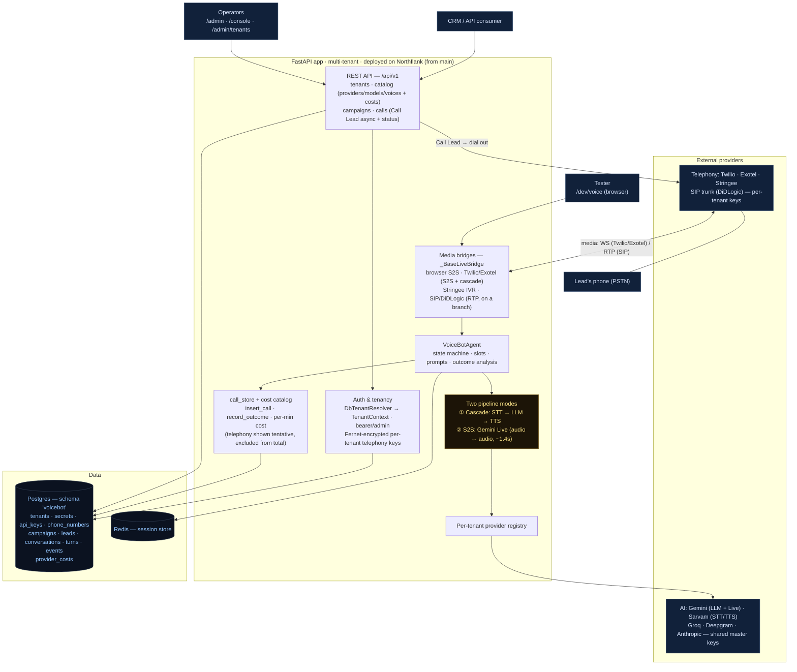

# Architecture

A single view of the system: a **multi-tenant, API-driven voice-agent platform**. A
CRM (or an operator via the browser consoles) registers a tenant, creates a campaign,
and places outbound calls; each call runs an AI agent over telephony (or the browser),
in one of two pipeline modes, and is recorded + billed to the database.

## How a call flows (Call Lead)
1. **Register** — `POST /api/v1/tenants` (admin) stores the tenant + provider/model
   choices; telephony keys are Fernet-encrypted into `tenant_secrets`. Returns an API token.
2. **Create campaign** — `POST /api/v1/campaigns` (+ CSV leads).
3. **Call Lead** — `POST /api/v1/campaigns/{id}/calls` (async, returns `call_id`): checks the
   campaign is active + the tenant's concurrency cap, places the outbound call on the tenant's
   telephony provider, and inserts an `in_progress` `conversations` row snapshotting the config.
4. **Run** — the carrier connects back to a **media bridge** (WS for Twilio/Exotel, in-process
   RTP for SIP). The bridge runs the **VoiceBotAgent** in the tenant's mode (cascade or S2S),
   using the per-tenant **provider registry**. Slots/action/state come from the LLM JSON envelope
   (cascade) or the `record_turn_signal` tool call (S2S).
5. **Teardown** — outcome analysis runs, and `record_outcome` writes status + outcome + **cost**
   (Σ provider cost/min × duration; telephony excluded as tentative) to the `conversations` row.
6. **Poll** — `GET /api/v1/calls/{id}` returns status/outcome/cost; the **backoffice**
   (`/admin/tenants`) aggregates per-tenant analytics + billing.

## Key properties
- **Multi-tenant, DB-backed.** All state lives in Postgres under the `voicebot` schema (shared
  DB); tenants resolve from the DB via bearer token / admin. No YAML at runtime.
- **Two pipeline modes.** Cascade (STT→LLM→TTS, the controllable default, ~3.2s first word) and
  S2S (Gemini Live, ~1.4s, native barge-in). Selectable per tenant (`pipeline.mode`).
- **Key isolation.** Only telephony keys are per-tenant (encrypted at rest); STT/LLM/TTS/S2S use
  shared platform master keys.
- **Cost model.** `provider_costs` keyed `(kind, provider, model)`, per-minute; per-call cost is
  the platform components only — telephony is the tenant's own trunk, shown as a *tentative* figure.
- **Browser consoles** are thin UIs over the same `/api/v1` (so using them exercises the API):
  `/admin` (register + costs), `/console` (campaigns/calls), `/admin/tenants` (analytics + billing),
  `/dev/voice` (live voice test — recorded + billed like a real call).

See `docs/PROJECT-STATUS.md` for component-by-component status and
`docs/sip-didlogic-integration-plan.md` for the SIP path.
