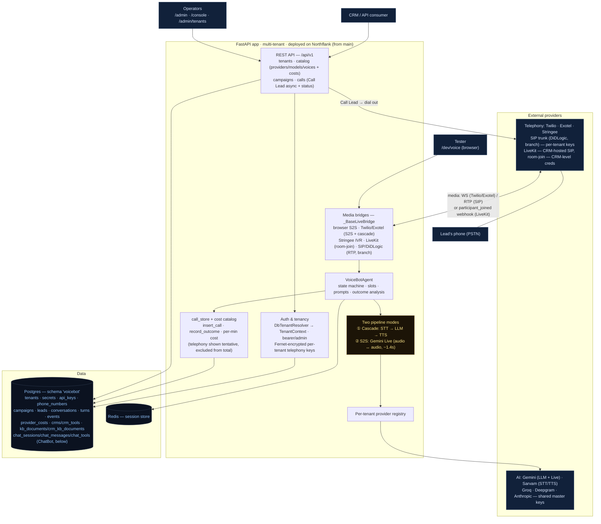
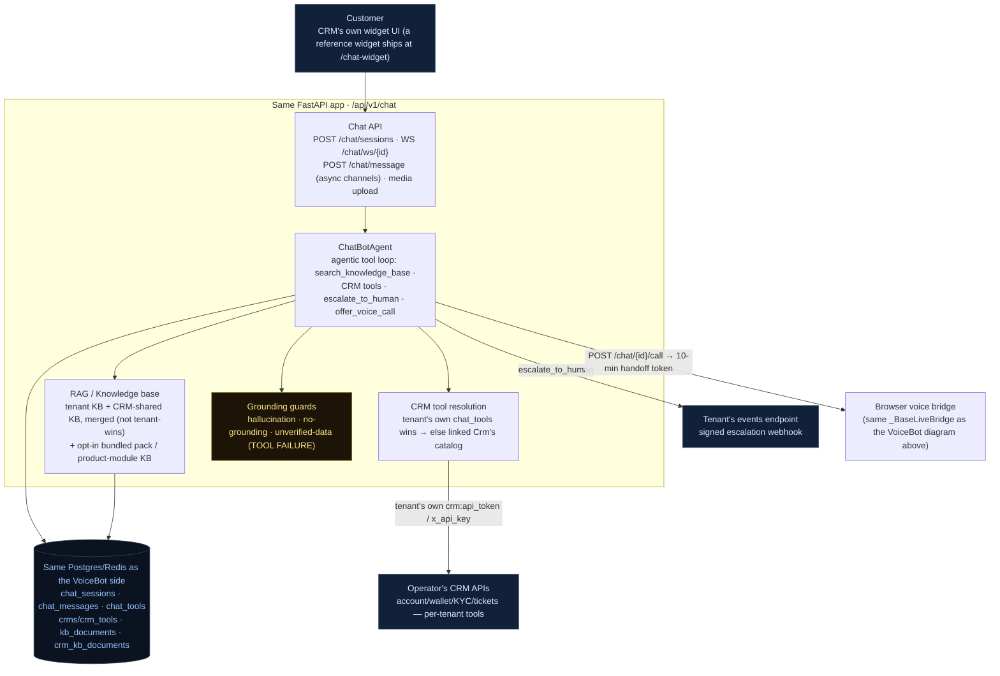

# Architecture

A single view of the system: a **multi-tenant, API-driven agent platform** with two
products sharing one backend. A CRM (or an operator via the browser consoles)
registers a tenant, then either places outbound calls (**VoiceBot**) or embeds the
chat widget for inbound support (**ChatBot**). Both run an AI agent — over telephony,
the browser, or a chat socket — against the same per-tenant provider registry,
knowledge base, and CRM-tool catalog, and are recorded + billed to the same database.

## VoiceBot: how a call flows

1. **Register** — `POST /api/v1/tenants` (admin) stores the tenant + provider/model
   choices; telephony keys are Fernet-encrypted into `tenant_secrets`. Returns an API token.
2. **Create campaign** — `POST /api/v1/campaigns` (+ CSV leads).
3. **Call Lead** — `POST /api/v1/campaigns/{id}/calls` (async, returns `call_id`): checks the
   campaign is active + the tenant's concurrency cap, places the outbound call on the tenant's
   telephony provider, and inserts an `in_progress` `conversations` row snapshotting the config.
4. **Run** — the carrier connects back to a **media bridge** (WS for Twilio/Exotel, in-process
   RTP for SIP, a room-join for LiveKit). The bridge runs the **VoiceBotAgent** in the tenant's
   mode (cascade or S2S), using the per-tenant **provider registry**. Slots/action/state come
   from the LLM JSON envelope (cascade) or the `record_turn_signal` tool call (S2S). LiveKit
   differs from the other providers in shape: the CRM fronts its own PSTN/SIP via LiveKit SIP
   and drops the caller into a room; this app has no outbound dial or inbound HTTP leg of its
   own for that path — the only trigger is a `participant_joined` webhook, and it joins as a
   WebRTC participant using CRM-level credentials (`Crm.livekit_url`), not per-tenant secrets.
5. **Teardown** — outcome analysis runs, and `record_outcome` writes status + outcome + **cost**
   (Σ provider cost/min × duration; telephony excluded as tentative) to the `conversations` row.
6. **Poll** — `GET /api/v1/calls/{id}` returns status/outcome/cost; the **backoffice**
   (`/admin/tenants`) aggregates per-tenant analytics + billing.

## ChatBot: how a chat flows

1. **Session** — `POST /chat/sessions` (tenant bearer) creates a `chat_sessions` row and
   returns `{session_id, greeting, ws_url}`; the `session_id` is itself the capability for the
   socket — `WS /chat/ws/{session_id}` needs no further auth.
2. **Turn** — the customer's message (text, image, or video) reaches `ChatBotAgent`, which runs
   an agentic loop: generate (text mode, tools available) → execute any tool calls
   (`search_knowledge_base`, a registered CRM tool, `escalate_to_human`, `offer_voice_call`) →
   feed results back → repeat → final reply. Every turn's knowledge search mixes the tenant's
   own KB with its linked CRM's shared KB (never tenant-wins-outright, unlike tools below);
   every CRM tool call resolves to the tenant's own registered tool first, falling back to the
   linked `Crm`'s shared catalog only if the tenant has none of its own.
3. **Grounding** — the reply passes through the hallucination/no-grounding guard when a KB
   search happened, and the unverified-data guard whenever a CRM tool was involved (called,
   or attempted and failed) — a number the reply states must trace back to something the model
   actually saw this turn, or the reply is replaced with a safe fallback, independent of what
   the model itself claims to have checked.
4. **Escalate or hand off** — the agent can offer a human (`escalate_to_human`, a signed
   webhook to the tenant's events endpoint) or a live voice call (`offer_voice_call` /
   `POST /chat/{id}/call`, which stashes the chat's context under a short-lived Redis token and
   hands off into the *same* browser voice bridge the VoiceBot diagram uses — the voicebot
   greets with the chat's own context already loaded).
5. **Persist** — every turn is written to `chat_sessions`/`chat_messages` in the same Postgres
   database as the voice side; the tenant's own or backoffice's console reads it back for
   history, handoff, and analytics.

## Key properties
- **Multi-tenant, DB-backed.** All state lives in Postgres under the `voicebot` schema (shared
  DB); tenants resolve from the DB via bearer token / admin. No YAML at runtime.
- **Two pipeline modes (VoiceBot).** Cascade (STT→LLM→TTS, the controllable default, ~3.2s
  first word) and S2S (Gemini Live, ~1.4s, native barge-in). Selectable per tenant
  (`pipeline.mode`); LiveKit calls also run through the S2S path.
- **Key isolation.** Only telephony keys are per-tenant (Fernet-encrypted); STT/LLM/TTS/S2S use
  shared platform master keys. LiveKit credentials are CRM-level (`Crm.livekit_url`), not
  per-tenant — a third tier alongside "per-tenant" and "shared platform."
- **Cost model.** `provider_costs` keyed `(kind, provider, model)`, per-minute; per-call cost is
  the platform components only — telephony is the tenant's own trunk, shown as a *tentative* figure.
- **Vertical content is opt-in per CRM, not baked into the platform (ChatBot).** A `Crm.prompt_pack`
  column selects which system-prompt vocabulary a linked tenant's ChatBot uses (`"generic"` by
  default, no industry-specific vocabulary; `"betting"` for the live betting operator); a
  `Crm.bundled_kb_pack` column separately selects which knowledge-base bundle (if any) is
  auto-seeded into that CRM's shared KB at boot. A CRM with neither set gets a fully
  industry-neutral chatbot with no bundled KB — the platform core makes no assumption about
  what kind of business a tenant runs.
- **CRM tools are substitutive, KB is additive.** A tenant's own registered CRM tool always
  wins outright over its linked `Crm`'s shared catalog (one implementation runs, never both);
  knowledge-base search always merges the tenant's own docs *with* the linked CRM's shared docs
  (both are useful at once, so both are searched).
- **Browser consoles** are thin UIs over the same `/api/v1` (so using them exercises the API):
  `/admin` (register + costs), `/console` (campaigns/calls), `/admin/tenants` (analytics + billing),
  `/dev/voice` (live voice test — recorded + billed like a real call), `/chat-widget` (reference
  chat UI — recorded + billed like a real chat session).

## Tools & providers by module

Every provider below is config-selected per tenant (or per CRM, where noted) through
`src/providers/get_*` — swapping one is a config change, not a code change, except
where noted.

| Module | Options | Notes |
|---|---|---|
| STT (batch) | Sarvam · Groq (Whisper) · Gemini | |
| STT (streaming) | Deepgram | the only streaming STT provider; batch providers above are the fallback |
| LLM | Gemini (also the S2S/Live provider) · Groq · Anthropic Claude · self-hosted vLLM (OpenAI-compatible, e.g. an IndicF5 RunPod pod) | Gemini is the active default for both VoiceBot and ChatBot |
| TTS | Sarvam · Gemini · Google · Azure · ElevenLabs · self-hosted IndicF5 | Sarvam (`bulbul:v2`) is the active default |
| Telephony (dial-out) | Twilio · Exotel · Stringee | behind the common `ITelephonyProvider` interface |
| Telephony (room-join) | LiveKit — CRM-hosted SIP, CRM-level credentials | separate integration, not behind `ITelephonyProvider` (no dial-out leg on this side) |
| Telephony (in progress) | SIP trunk / DiDLogic (pyVoIP, in-app RTP) | built on a branch, not merged |
| Vector store (RAG) | `pgvector` (the configured default) · file-backed `faiss` (alternative, per-tenant only) | selected via `vector_store.provider` config; **CRM-level shared KB requires pgvector** — FAISS has no CRM-level tier by design |
| Embeddings | Gemini (`GeminiEmbedder`, 384-dim, multilingual) | `LocalEmbedder` (`sentence-transformers`) also exists in `src/rag/embeddings.py` but isn't what's wired into the live retriever factory |
| Sparse retrieval | BM25 (`rank-bm25`) | fused with the vector-store dense results in `HybridRetriever` (default 70/30 dense/sparse weighting) |
| Primary datastore | Postgres, schema `voicebot` | shared DB — no dedicated database needed, `search_path`-scoped |
| Session/cache store | Redis | |
| Deployment | Docker image on Northflank, auto-deploy from git | |

See `docs/PROJECT-STATUS.md` for component-by-component status,
`docs/chatbot.md` for the full ChatBot API/DB reference, and
`docs/sip-didlogic-integration-plan.md` for the SIP path.
