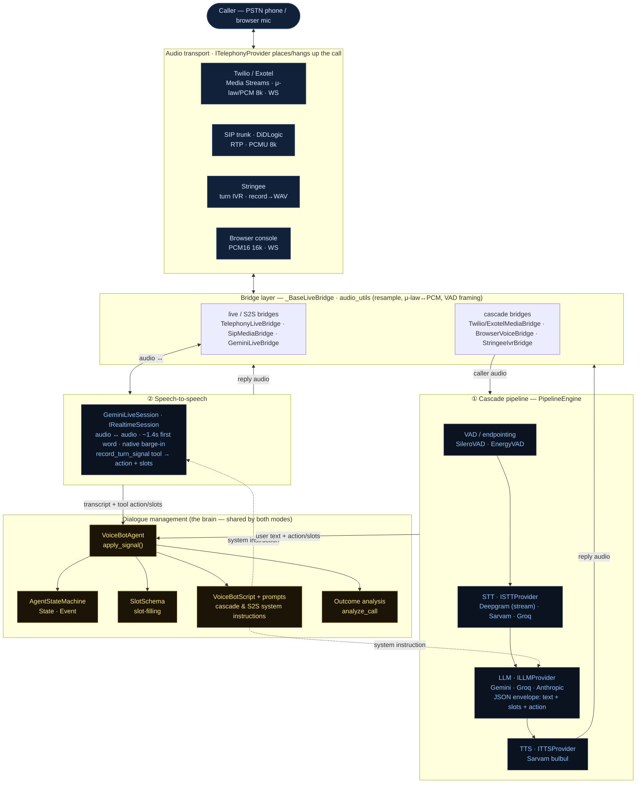

# Voice architecture (the conversation runtime)

How one **voice turn** flows: caller audio comes in over a telephony/browser
transport, a **bridge** adapts it, it runs through one of **two pipelines** —
① the STT→LLM→TTS **cascade** or ② **speech-to-speech** (Gemini Live) — and the
**dialogue manager** (agent + state machine + slots + prompts) governs the turn and
records the outcome. All providers sit behind small interfaces.

## The turn loop
1. **In** — caller audio arrives over the transport (Twilio/Exotel Media Streams μ-law/PCM @ 8 kHz,
   SIP/DiDLogic RTP @ 8 kHz, Stringee recorded WAV, or the browser at 16 kHz). The **bridge**
   (`_BaseLiveBridge` family) normalizes/resamples it (`audio_utils`).
2. **Understand** —
   - **Cascade:** VAD/endpointing detects end-of-utterance → **STT** → **LLM** (returns a JSON
     envelope: `response_text` + `updated_slots` + `action`) → **TTS** synthesizes the reply.
   - **S2S:** audio streams straight into **GeminiLiveSession**, which speaks the reply directly and
     emits a `record_turn_signal` tool call carrying `action` + `updated_slots`.
3. **Decide** — either path feeds **`VoiceBotAgent.apply_signal()`**, which advances the
   **state machine**, merges **slots**, and uses the **script/prompts** to steer the next turn.
4. **Out** — reply audio goes back through the bridge to the caller.
5. **End** — on hangup/terminal state, **`analyze_call`** classifies the outcome (interested,
   callback, no_answer, …) from the transcript + slots.

## Notes
- **Two modes, one brain.** Cascade and S2S share the same dialogue manager (state machine, slots,
  prompts, outcome). They differ only in *how* speech↔intent is produced: serialized STT→LLM→TTS
  vs. end-to-end audio. `pipeline.mode` selects per tenant; cascade is the controllable default,
  S2S the low-latency path (~1.4 s vs ~3.2 s first word).
- **Interfaces decouple providers.** `ISTTProvider`/`IStreamingSTTProvider`, `ILLMProvider`,
  `ITTSProvider`, `IRealtimeSession`, `ITelephonyProvider` — each provider is a swappable adapter
  behind its interface (Sarvam, Groq, Deepgram, Gemini, Anthropic, Gemini Live; Twilio/Exotel/
  Stringee/SIP).
- **Audio formats.** Telephony is 8 kHz mono (μ-law on Twilio, PCM on Exotel, PCMU/RTP on SIP);
  the browser is 16 kHz; bridges resample to the model's rate and back.
- **Barge-in.** S2S has it natively; the browser cascade has server-side barge-in; telephony
  cascade barge-in is a pending fast-follow.
